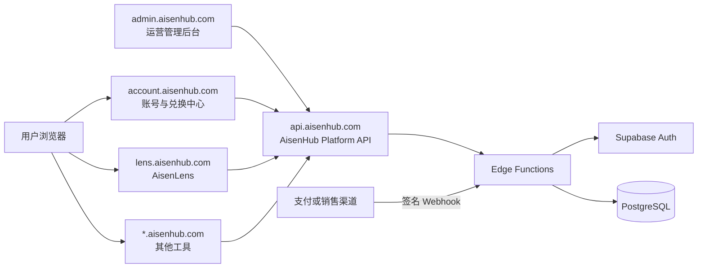
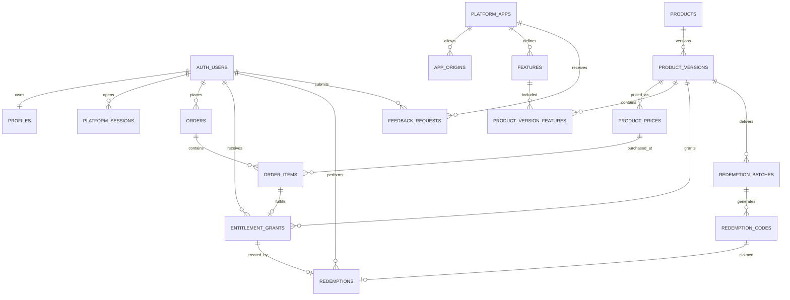
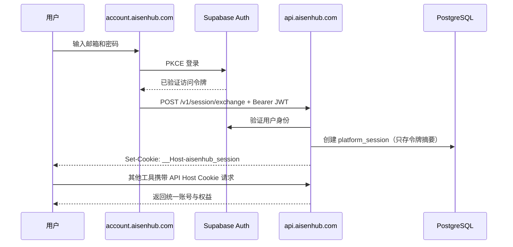
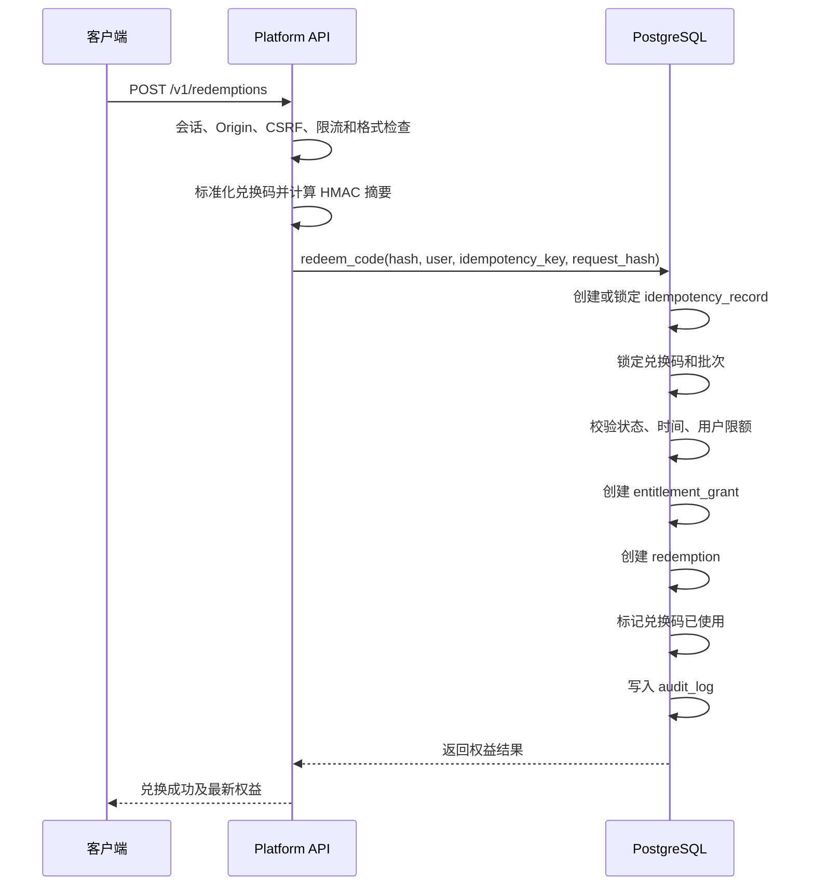

# AisenHub 多产品平台后端架构方案

> 状态：目标架构，待实施
>
> 适用范围：AisenHub Platform 后端建设；AisenLens（`lens.aisenhub.com`）及后续 `*.aisenhub.com` 工具接入
>
> 最后核对：2026-08-31
>
> 文档权威：本文件是 AisenHub Platform 数据模型、API、权限、安全、测试、部署与实施顺序的唯一总体架构事实来源。`docs/admin架构.md` 是 Admin 技术选型与借鉴依据；如有冲突，以本文件为准。

## 1. 决策摘要

现有 AisenLens 后端没有需要保留的生产数据，本方案不设计旧表迁移、兼容 RPC、双写或回滚到旧模型。实施时直接废弃 `free/supporter` 单角色模型、AisenLens 专用兑换活动和旧支持请求模型，建立新的平台基线。

目标系统采用以下总体方案：

- 使用一个独立的 **AisenHub Platform** 仓库承载平台后端、账号中心、管理后台和客户端 SDK。
- 继续使用 **Supabase Auth + PostgreSQL + RLS + Edge Functions**，早期采用托管 Supabase，不自建微服务集群。
- 后端采用**模块化单体**：一个数据库、一套身份系统、一组受控 API，代码和数据按领域模块隔离。
- AisenLens 只是平台中的第一个应用，后续 `len.aisenhub.com`、`img.aisenhub.com` 等工具以相同协议接入。
- 将“应用、功能、商品、商品版本、订单、权益授予、兑换码”分开建模。
- 商品版本只表达“交付什么”，价格由独立 `product_prices` 表表达；第一版不建设促销/优惠规则引擎。
- 买断并不记录为用户角色，而记录为可审计、可撤销、可过期的 `entitlement_grants`。
- 普通工具买断固定使用购买时的商品版本快照；第一版不提供可任意跟随最新版的通用 `rolling` 权益。
- 订单按 `order_item` 授予权益，多商品订单在一个事务中生成多条可独立退款的授权记录。
- 兑换码只是一种权益来源；支付、管理员赠送、活动赠送也通过同一个权益授予模型落库。
- 所有敏感写操作通过 Edge Functions 或受控数据库函数完成；产品前端不得直接写订单、兑换码、权益和审计表。
- 会话、订单、支付、兑换码、权益、幂等和审计等敏感表放入不对 Data API 暴露的 `platform` schema；RLS 是纵深防御，不是唯一边界。
- 统一登录通过 `account.aisenhub.com` 和 `api.aisenhub.com` 完成。各工具不共享父域 Cookie，也不分别维护账号。
- `apps/admin` 正式采用 **React + Refine Core + AisenHub Design System**；Refine 只是可替换的 Admin 前端框架，不是 Backend、Auth、RBAC、Workflow、Audit 或 Database 权威。
- Admin 只通过 `/v1/admin/*` 使用平台能力，不直接依赖 Supabase Data API、Refine Supabase Data Provider 或 PostgreSQL 表结构。
- 第一阶段不引入 OpenFGA、Lago、Polar、Unkey 等独立服务，只吸收其成熟的数据建模和安全边界；当复杂度达到明确门槛后再评估引入。

## 2. 背景与现状问题

当前 Supabase 后端已经验证了以下方向：

- Supabase Auth 管理账号。
- RLS 保护用户数据。
- 数据库 RPC 处理反馈、支持请求和兑换。
- 兑换时使用数据库事务和行锁。
- 兑换码只存储摘要。
- 前端通过 `services/supabase/` 收敛外部访问。

这些原则继续保留，但现有结构仍然是 AisenLens 单产品模型：

- `user_entitlements` 每个用户只有一行，只能表达 `free` 或 `supporter`。
- `redemption_campaigns.entitlement_kind` 写死为 `supporter`。
- `redeem_support_code`、`AL-` 前缀和活动名称均与 AisenLens 耦合。
- 没有平台应用、商品、商品版本、功能权益、订单和支付事件模型。
- 反馈没有稳定的应用来源标识。
- 各前端直接使用 Supabase 浏览器会话，不具备跨子域统一登录。
- 没有数据库权限测试、兑换并发测试、统一 API 契约和平台客户端 SDK。

由于当前没有生产数据，实施时应创建干净的初始迁移，不在旧模型上逐层补丁式演进。

## 3. 目标与非目标

### 3.1 目标

1. 一个账号可以访问多个 AisenHub 产品和工具。
2. 支持单工具买断、工具包买断、全站买断和限时授权。
3. 支持兑换码、在线订单、管理员赠送等多种授权来源。
4. 权益检查具有统一、稳定、可测试的接口。
5. 所有产品共享账号、订单、权益、兑换、反馈和审计能力。
6. 产品可以独立开发和部署，不直接依赖平台数据库结构。
7. 能在不修改历史购买记录的情况下调整未来商品内容。
8. 为未来订阅、使用额度、AI 调用和文件任务预留扩展边界，但不提前实现复杂计费。
9. 本地优先工具可以继续在浏览器运行，平台后端只承载账号与商业能力。
10. 数据库结构、RLS、函数、类型和 API 契约都可在本地复现并自动测试。

### 3.2 非目标

- 第一版不建设微服务体系。
- 第一版不自研完整支付清算、发票或税务系统。
- 第一版不引入复杂关系权限引擎。
- 第一版不实现设备指纹、机器绑定或强 DRM。
- 第一版不把 AisenLens 本地项目和视频上传到平台数据库。
- 第一版不实现跨品牌、多商户或让第三方租户自行创建产品。
- 第一版不实现独立顶级域名的单点登录，只保留 OAuth 2.1 Authorization Code + PKCE 的扩展边界。
- 第一版不实现通用促销、优惠组合、额度账本、用量计费或外部审计归档。
- 第一版不承诺 AI、云文件处理等持续成本能力可以无限永久使用。

## 4. 参考方案与采用结论

### 4.1 Supabase

采用其 PostgreSQL、Auth、RLS、Edge Functions、数据库函数和自定义 API 域名能力。平台数据的最终一致性由 PostgreSQL 事务保证，浏览器不持有服务角色密钥。

参考：

- [Supabase 数据库](https://supabase.com/docs/guides/database/overview)
- [Supabase RLS](https://supabase.com/docs/guides/database/postgres/row-level-security)
- [Supabase Edge Functions 安全](https://supabase.com/docs/guides/functions/auth)
- [Supabase 自定义域名](https://supabase.com/docs/guides/platform/custom-domains)

### 4.2 Polar

Polar 将一次性购买和订阅统一建模为商品，并将 License Key、文件下载、功能开关等交付内容作为商品 Benefit。AisenHub 采用“商品与交付权益分离”的思想，但不引入 Polar 服务，也不复制其支付和税务体系。

参考：[polarsource/polar](https://github.com/polarsource/polar)

### 4.3 Lago

Lago 将 Feature、Entitlement 和 Billing 分开：功能定义独立于套餐，套餐只是配置功能权限和值。AisenHub 采用独立 `features` 和 `product_version_features`，避免把权限写死为产品角色。

参考：

- [getlago/lago](https://github.com/getlago/lago)
- [Lago Entitlements](https://doc.getlago.com/guide/entitlements)

### 4.4 Unkey

Unkey 的可复用原则包括：密钥只保存摘要、密钥按作用域授权、验证与管理权限分离、请求限流、不可变审计。AisenHub 将这些原则用于兑换码和未来 API Key，但第一版不部署 Unkey。

参考：[unkeyed/unkey](https://github.com/unkeyed/unkey)

### 4.5 OpenFGA

OpenFGA 将授权模型、关系数据和授权检查分开，并强调授权模型测试。AisenHub 第一版的关系只有“用户—商品权益—功能”，PostgreSQL 足以表达；只有出现组织、团队、共享资源和复杂继承关系时才评估 OpenFGA。

参考：[openfga/openfga](https://github.com/openfga/openfga)

### 4.6 OpenReel 与 OpenCut

- OpenReel 的 API 代理集中管理端点、允许来源、路径白名单、请求体上限和上游超时。AisenHub 的 API 网关采用同类边界，但不接受由浏览器传入第三方私钥。
- OpenCut 将服务端认证、会话、限流、输入校验和 API 路由收敛在服务端。AisenHub 保留该边界，但继续使用 Supabase Auth 和 Edge Functions，不引入 Better Auth、Drizzle 或 Redis 作为初始依赖。

### 4.7 `adv.md` 18 项建议评估结论

本轮只做现有模块化单体内的增量加固。`采用` 表示进入第一版模型或流程；`设计预留` 表示只固定边界和演进方向，不创建当前没有消费者的运行时能力；`调整采用` 表示接受问题判断，但以更小的实现解决。

| # | 优先级 | 结论 | 处理方式与理由 |
| --- | --- | --- | --- |
| 1 | P0 | 采用 | 订单权益来源改为 `order_item`，从根本上支持一单多商品和逐项退款。 |
| 2 | P0 | 采用 | `products.current_version_id` 明确当前销售版本；`published` 只表示曾发布，`retired` 不使历史快照权益失效。 |
| 3 | P0 | 调整采用 | 普通买断一律 `snapshot`。不实现可任意跟随最新版的通用 `rolling`；全站未来工具承诺使用稳定元功能 `hub.all_apps_access`，避免删功能导致历史权益倒退。 |
| 4 | P0 | 调整采用 | 增加 `product_prices`，从 `product_versions` 移除价格；暂不增加 Offer/Promotion 规则引擎，兑换码优先阶段没有必要。 |
| 5 | P0 | 采用 | `features` 增加受类型约束的 `merge_strategy`，服务端统一合并多来源权益值。 |
| 6 | P0 | 采用 | 以已登记的精确 `Origin` 反查 `app_id`；`X-AisenHub-App` 只是声明且必须与反查结果一致。 |
| 7 | P0 | 采用 | 敏感表进入不暴露的 `platform` schema，`public` 仅保留受控视图/入口，RLS 继续作为纵深防御。 |
| 8 | P0 | 采用 | 增加统一 `idempotency_records`；支付渠道事件仍保留外部事件唯一约束，因为两者解决的身份空间不同。 |
| 9 | P1 | 采用 | Admin 增加赠送权益动作，复用唯一 `grant_entitlement` 领域函数。 |
| 10 | P1 | 设计预留 | 第一版全是 `*.aisenhub.com`，不建设授权服务器；为未来独立域名固定 Authorization Code + PKCE/一次性交换码边界。 |
| 11 | P1 | 采用 | 增加账号删除、去标识化和按数据类别保留策略；具体法定保留年限在上线地区确定后配置。 |
| 12 | P1 | 采用 | `app.slug`、`product.sku`、`feature.code` 首次被引用/发布后不可修改，只允许改展示名。 |
| 13 | P1 | 采用 | Admin 使用 `owner/admin/support/finance` 简单 RBAC；当前关系不需要 OpenFGA。 |
| 14 | P1 | 设计预留 | 记录未来 `app_credentials` 模型和作用域，但在出现服务端消费者前不建表、不发密钥。 |
| 15 | P1 | 采用 | 明确支付、订单、授权的退款/拒付/恢复状态机；授权只撤销不删除，恢复创建新授权并关联原记录。 |
| 16 | P1 | 采用 | 无生产数据时可建立干净基线；正式上线后数据库变更统一使用 expand → migrate → contract。 |
| 17 | P2 | 设计预留 | 明确 `entitlement ≠ balance ≠ usage`，第一版不创建额度和用量表。 |
| 18 | P2 | 设计预留 | 交易上线且审计合规需求明确后再做外部不可变归档，第一版保留数据库追加式审计。 |

本轮没有完全否定的建议；第 10、14、17、18 项因当前没有实际消费者而只固定扩展边界，不进入第一版实施。第 3、4 项接受其风险判断，但分别用“稳定 All Access 元功能”和“独立 Price、暂不建 Offer 引擎”控制首版复杂度。

### 4.8 Admin 技术选型

`apps/admin` 正式采用 React、Refine Core 和 AisenHub Design System。Refine 提供 Resource、Router、Data/Auth/Access Control Provider 等前端骨架；所有 Provider 都由 AisenHub 适配 `/v1/admin/*`，不使用 Refine Supabase Data Provider。Refine 可以在 API 契约不变时被替换。

React-admin 仅作为第二选择和 List/Filter UX 参考；Appsmith、ToolJet、NocoBase、Directus 只提供设计借鉴，不是运行时依赖。完整比较、许可证核对和选择理由保留在 [Admin ADR / Technical Evaluation](./admin架构.md)。

## 5. 系统上下文



### 5.1 域名职责

| 域名 | 职责 |
| --- | --- |
| `aisenhub.com` | 品牌主页与工具导航，不承载敏感管理能力 |
| `account.aisenhub.com` | 注册、登录、账号资料、兑换码、已购产品和会话管理 |
| `admin.aisenhub.com` | 商品、兑换码、订单、权益、反馈和审计管理 |
| `api.aisenhub.com` | 唯一平台 API 与 Auth 自定义域名 |
| `*.aisenhub.com` | 独立工具前端，只通过平台 SDK 使用账号与权益 |

生产环境应使用 `api.aisenhub.com`。优先启用 Supabase 自定义域名；如果当前套餐不支持，则使用只负责 TLS、路由和安全头的薄代理。产品代码只依赖 `AISENHUB_API_URL`，不得写死 Supabase 项目域名。

## 6. 代码与仓库边界

### 6.1 新建独立平台仓库

建议建立独立仓库 `AisenHub-platform`：

```text
AisenHub-platform/
├─ apps/
│  ├─ account/                 账号与兑换中心
│  └─ admin/                   React + Refine Core 运营管理后台
├─ packages/
│  ├─ platform-client/         普通产品与 account 的平台客户端
│  ├─ admin-client/            Admin Data Provider 与 Command Client
│  ├─ contracts/               API、错误码与权限 Action 的唯一类型来源
│  ├─ design-system/           Token 与共享 Admin UI 组件
│  └─ config/                  工具链共享配置
├─ supabase/
│  ├─ config.toml
│  ├─ migrations/
│  ├─ functions/
│  │  ├─ _shared/
│  │  ├─ platform-api/
│  │  ├─ platform-public/
│  │  ├─ platform-admin/
│  │  └─ payment-webhook/
│  ├─ tests/
│  └─ seed.sql
├─ docs/
└─ scripts/
```

平台仓库是以下内容的唯一来源：

- 数据库结构和迁移
- RLS 与数据库权限
- Edge Functions
- API 契约与错误码
- 平台客户端 SDK
- 账号中心和管理后台
- 平台级测试与发布流程

包的职责和依赖方向固定为：

```text
apps/account、各工具 ─→ platform-client ─→ contracts
apps/admin ───────────→ admin-client ─────→ contracts
apps/admin ───────────→ design-system
全部 workspace ───────→ config（仅工具链配置）
```

- `platform-client` 供 AisenLens、Image/PDF 等普通工具和 `apps/account` 使用，处理 session、profile、entitlement、redemption、feedback 与 public catalog。
- `admin-client` 只供 `apps/admin` 使用，包含 `AisenHubAdminDataProvider`、`AisenHubBusinessCommandClient`、Admin API 契约适配和错误映射；不得包含 Supabase SDK、SQL 或数据库访问。
- `contracts` 是请求、响应、稳定错误码、分页/过滤结构和权限 Action 的唯一类型来源，不依赖任一应用或客户端。
- `design-system` 存放 AisenHub Design Token、DataTable、EntityPage、FilterBar、Timeline、DangerousActionDialog、通用 Form 与 Empty/Error/Loading；不得依赖 `admin-client` 或业务模块。
- 应用只能依赖包，包不得反向依赖应用；`platform-client` 与 `admin-client` 彼此不依赖，避免普通产品意外携带管理能力。

### 6.2 AisenLens 仓库调整

AisenLens 应在平台稳定后移除自身的 `supabase/migrations/` 和 AisenLens 专用 RPC，改为：

```text
apps/web/src/services/aisenhub/
├─ client.ts
├─ session.ts
├─ entitlements.ts
├─ redemption.ts
└─ feedback.ts
```

这些文件只能调用 `@aisenhub/platform-client`，不得了解平台表名或直接查询订单、权益和兑换表。

AisenLens 的 IndexedDB 项目库、视频、截图和分析数据继续保持本地优先，不进入统一后端。

## 7. 模块化单体边界

```text
Identity       用户身份、资料、平台会话
Application    应用注册、域名与来源白名单
Catalog        功能、商品和商品版本
Pricing        商品版本的价格与销售渠道
Commerce       订单、订单项、支付、退款与拒付状态
Entitlement    权益授予、撤销和访问决策
Redemption     兑换批次、兑换码和兑换记录
Feedback       按应用归属的用户反馈
Administration 管理员成员、角色、权限、Admin Session、MFA/AAL 与受控 Administrative Commands
Audit          不可变审计和安全事件
Idempotency    跨写接口的请求去重与结果复用
Usage          未来的额度、用量和积分账本
```

模块之间可以在同一个 PostgreSQL 中通过外键和事务协作，但不得出现以下耦合：

- 商品表直接存储用户权限。
- 用户表直接存储 `is_pro`、`supporter` 等产品状态。
- 兑换码直接修改用户角色。
- 前端根据订单状态自行推断权益。
- 工具业务表反向成为账号或订单的权威来源。
- 将权益、余额和用量混入同一张表；未来额度能力必须使用独立账本和用量事件。

## 8. 核心数据模型

除明确标注为公开视图外，下列表均位于 `platform` schema。文档省略 schema 前缀以保持可读性；migration、函数和 SQL 必须使用全限定名。

### 8.1 关系概览



### 8.2 身份与应用

#### `profiles`

| 字段 | 说明 |
| --- | --- |
| `id uuid PK` | 与 `auth.users.id` 一致 |
| `display_name text` | 展示名称 |
| `avatar_url text` | 可选头像 |
| `locale text` | 用户语言 |
| `status text` | `active / disabled / deletion_pending / deleted` |
| `deleted_at` | 完成去标识化的时间 |
| `created_at / updated_at` | 时间戳 |

账号密码、邮箱验证和第三方登录由 Supabase Auth 管理，业务表不得复制密码或刷新令牌。

账号删除采用“先冻结、再去标识化”的流程：撤销平台会话和有效权益，清空 profile 展示字段并置为 `deleted`，通过 Supabase Auth 的受控软删除/匿名化能力使身份不可再登录。业务表中的 UUID 只作为不可登录的伪名化关联键；订单、支付和审计按合规要求保留，但移除邮箱、名称、原始 IP 等直接身份信息。法定保留年限由上线地区和支付渠道确定后配置，不在架构中写死。

#### `platform_apps`

| 字段 | 说明 |
| --- | --- |
| `id uuid PK` | 应用 ID |
| `slug text UNIQUE` | `aisenlens`、`length`、`image-compressor` |
| `name text` | 展示名称 |
| `category text` | 工具分类 |
| `status text` | `draft / active / suspended / retired` |
| `primary_feature_id uuid` | 应用主访问功能 |
| `metadata jsonb` | 非安全展示配置 |
| `created_at / updated_at` | 时间戳 |

`slug` 是机器标识。应用首次被 Origin、Feature 或审计记录引用后不可修改；改名只修改 `name`。

#### `app_origins`

| 字段 | 说明 |
| --- | --- |
| `id uuid PK` | 来源记录 |
| `app_id uuid FK` | 所属应用 |
| `environment text` | `development / staging / production` |
| `origin text UNIQUE` | 完整 Origin，例如 `https://len.aisenhub.com` |
| `is_active boolean` | 是否允许调用 |

生产环境不使用 `*.aisenhub.com` 通配白名单。每个新工具上线前必须注册精确 Origin。

未来如果工具服务端需要以应用身份调用平台，可增加 `app_credentials(app_id, client_id, secret_hash, scopes, status, expires_at)`。第一版没有服务端消费者，不创建该表、不签发 Secret；当前请求身份始终来自用户会话和 Origin，不能用浏览器中的应用标识冒充服务凭据。

#### `platform_sessions`

平台会话是跨工具统一登录的权威，不直接共享 Supabase 浏览器 localStorage。

| 字段 | 说明 |
| --- | --- |
| `id uuid PK` | 会话 ID |
| `user_id uuid FK` | 用户 |
| `token_hash text UNIQUE` | 256 位随机会话令牌摘要 |
| `csrf_hash text` | CSRF 令牌摘要 |
| `expires_at` | 过期时间 |
| `last_seen_at` | 最近活动 |
| `revoked_at` | 撤销时间 |
| `ip_hash / user_agent` | 最小化安全上下文 |
| `created_at` | 创建时间 |

#### `account_deletion_requests`

| 字段 | 说明 |
| --- | --- |
| `id uuid PK` | 删除请求 ID |
| `user_id uuid FK` | 请求账号 |
| `status text` | `pending / processing / completed / failed / cancelled` |
| `execute_after` | 可选冷静期结束时间 |
| `attempt_count / last_error_code` | 安全重试信息，不保存敏感错误正文 |
| `requested_at / completed_at` | 状态时间 |

同一用户最多一条未结束请求。该表让跨 PostgreSQL 与 Supabase Auth 的删除流程可恢复，不需要为第一版引入消息队列。

### 8.3 商品与功能

#### `features`

功能是权限检查的最小单位，而不是页面名称或用户角色。

| 字段 | 说明 |
| --- | --- |
| `id uuid PK` | 功能 ID |
| `app_id uuid FK NULL` | 为空表示平台级功能 |
| `code text UNIQUE` | 如 `aisenlens.app.access` |
| `name text` | 展示名称 |
| `value_type text` | `boolean / integer / string / json` |
| `status text` | `active / retired` |
| `merge_strategy text` | `any_true / sum / max / min / latest` |
| `created_at` | 创建时间 |

`code` 首次进入已发布商品版本后不可修改。数据库必须约束策略与类型兼容：`boolean` 只能使用 `any_true`；`integer` 可使用 `sum / max / min / latest`；`string / json` 只能使用 `latest`。`latest` 按授予 `created_at` 降序、`grant_id` 降序确定结果，避免调用端产生不同答案。

首批建议功能：

```text
aisenlens.app.access
aisenlens.supporter_feedback
hub.remove_ads
hub.all_apps_access
```

#### `products`

`products` 是稳定的销售身份，不能因修改价格或功能而重建历史身份。

| 字段 | 说明 |
| --- | --- |
| `id uuid PK` | 商品 ID |
| `sku text UNIQUE` | `AISENLENS_LIFETIME` |
| `name text` | 商品名称 |
| `billing_type text` | `one_time / subscription / credits` |
| `status text` | `draft / active / archived` |
| `current_version_id uuid FK NULL` | 当前可销售版本；必须属于本商品且为 `published` |
| `entitlement_policy text` | `snapshot / all_apps_access`，默认 `snapshot` |
| `created_at / updated_at` | 时间戳 |

`sku` 是外部订单、审计和客服使用的机器标识。商品产生已发布版本、订单项或授权后不可修改。展示名和描述可继续编辑。

#### `product_versions`

商品版本冻结某次销售承诺。已发布版本不可原地修改，只能创建新版本。

| 字段 | 说明 |
| --- | --- |
| `id uuid PK` | 商品版本 ID |
| `product_id uuid FK` | 所属商品 |
| `version integer` | 从 1 递增 |
| `status text` | `draft / published / retired` |
| `access_duration_days integer NULL` | 永久买断为空 |
| `sales_terms jsonb` | 销售承诺快照 |
| `published_at` | 发布时间 |
| `created_at` | 创建时间 |

必须建立 `UNIQUE(product_id, version)`。发布后功能和销售条款不可原地修改。`published` 表示该版本曾形成销售承诺，不等于当前在售；`retired` 只停止新销售，不影响已经绑定该版本的历史权益。更新当前版本必须调用受控函数，在同一事务内验证版本归属和状态后更新 `products.current_version_id`。

#### `product_prices`

价格表达“以什么币种、渠道和金额销售”，不属于功能承诺版本。

| 字段 | 说明 |
| --- | --- |
| `id uuid PK` | 价格 ID |
| `product_version_id uuid FK` | 被定价的商品版本 |
| `currency char(3)` | ISO 4217 币种 |
| `amount_minor bigint` | 最小货币单位金额，必须大于等于 0 |
| `channel text` | `manual / redemption / provider_name` |
| `external_price_id text NULL` | 支付渠道价格 ID |
| `status text` | `draft / active / retired` |
| `valid_from / valid_until` | 可售时间窗 |
| `created_at / updated_at` | 时间戳 |

同一渠道的 `external_price_id` 非空时必须唯一。第一版不实现 Offer、优惠叠加、区域定价或优惠券规则；将来确有需求时，Offer 只能引用 `product_prices`，不得反向修改已发布商品版本。

#### `product_version_features`

| 字段 | 说明 |
| --- | --- |
| `product_version_id uuid FK` | 商品版本 |
| `feature_id uuid FK` | 功能 |
| `value jsonb` | 功能值，例如 `true`、`100` |
| `created_at` | 创建时间 |

联合主键：`(product_version_id, feature_id)`。

数据库函数在写入时按 `features.value_type` 验证 `value` 的 JSON 类型。普通产品权益永远使用购买/兑换时固定的 `product_version_id`。第一版不允许通用 `rolling`：若销售“包含未来工具”的全站产品，商品版本授予稳定元功能 `hub.all_apps_access = true`，访问决策按当前处于 `active` 的应用解释该元功能；未来新增工具自动纳入，而某个商品版本内已经承诺的普通 Feature 不会因“最新版删功能”而消失。

### 8.4 订单与支付

#### `orders`

| 字段 | 说明 |
| --- | --- |
| `id uuid PK` | 订单 ID |
| `order_no text UNIQUE` | 对用户展示的订单号 |
| `user_id uuid FK NULL` | 购买用户；账号删除完成后可解除直接身份关联 |
| `customer_ref uuid` | 不含个人信息的历史关联号 |
| `status text` | `pending / paid / fulfilled / cancelled / partially_refunded / refunded / chargeback` |
| `currency char(3)` | 币种 |
| `amount_total bigint` | 总金额 |
| `channel text` | `manual / provider_name / code_sale` |
| `paid_at / fulfilled_at / cancelled_at / refunded_at` | 状态时间 |
| `created_at / updated_at` | 时间戳 |

#### `order_items`

每个订单项必须是独立来源实体，至少包含：

| 字段 | 说明 |
| --- | --- |
| `id uuid PK` | 权益授予与退款的最小追踪单位 |
| `order_id uuid FK` | 所属订单 |
| `product_id / product_version_id` | 稳定商品与具体承诺版本 |
| `product_price_id uuid FK NULL` | 使用的平台价格；外部人工订单可为空 |
| `quantity integer` | 第一版权益商品固定为 1 |
| `unit_amount / total_amount bigint` | 成交金额快照 |
| `product_name / sku_snapshot` | 展示与客服快照 |
| `sales_terms jsonb` | 成交时销售承诺快照 |
| `fulfillment_status text` | `pending / granted / revoked` |
| `refunded_amount bigint` | 已退款金额 |
| `created_at / updated_at` | 时间戳 |

多商品订单支付成功时逐个订单项授予权益；每条权益以 `source_type = order_item`、`source_id = order_items.id` 唯一关联。这样同一订单可生成多条授权，又不会与来源唯一约束冲突。

#### `payments` 与 `payment_events`

- `payments` 保存支付渠道交易身份与 `pending / succeeded / partially_refunded / refunded / disputed / failed` 状态，不保存完整支付凭据。
- `payment_events` 按 `(provider, external_event_id)` 唯一，保证 Webhook 幂等。
- 支付成功只触发统一的 `grant_entitlement` 领域操作，不直接更新用户资料或角色。
- 全额退款或拒付通过撤销对应订单项的 `entitlement_grant` 完成，并写入审计；仅价格补偿且用户仍保留商品时不撤销权益。

第一版如果仍采用人工核验，可使用 `channel = manual`，但必须沿用订单状态机，不能重新引入“支持请求等同订单”的临时模型。

### 8.5 权益

#### `entitlement_grants`

| 字段 | 说明 |
| --- | --- |
| `id uuid PK` | 权益授予 ID |
| `user_id uuid FK` | 获得权益的用户 |
| `product_id uuid FK` | 稳定商品身份 |
| `product_version_id uuid FK` | 授予时商品版本 |
| `resolution_mode text` | 第一版固定为 `snapshot`；保留字段用于显式协议演进 |
| `source_type text` | `order_item / redemption / admin / promotion / admin_restore` |
| `source_id uuid` | 来源记录 ID |
| `status text` | `active / revoked` |
| `starts_at` | 生效时间 |
| `expires_at NULL` | 永久权限为空 |
| `revoked_at / revoke_reason` | 撤销信息 |
| `restores_grant_id uuid FK NULL` | 恢复授权时关联被撤销的原授权 |
| `created_at` | 创建时间 |

必须建立：

```text
UNIQUE(source_type, source_id)
INDEX(user_id, status, expires_at)
INDEX(product_id, status)
```

`source_type = order_item` 时 `source_id` 必须来自 `order_items.id`，并由受控函数校验来源所属用户、商品和版本。由于多态来源无法用普通外键完整表达，禁止客户端直接插入，数据库领域函数和约束测试必须覆盖每种来源。同一用户可以拥有多条权益。访问决策基于全部有效授予合并，而不是依赖单个角色字段。

授权状态只允许 `active → revoked`，不允许删除或把原记录改回 `active`。误撤销或退款后恢复时创建新的 `admin_restore` 授权，并通过 `restores_grant_id` 指向原记录，以保留完整因果链。

### 8.6 兑换码

#### `redemption_batches`

| 字段 | 说明 |
| --- | --- |
| `id uuid PK` | 批次 ID |
| `name text` | 批次名称 |
| `product_id / product_version_id` | 兑换后授予的商品版本 |
| `resolution_mode` | 第一版固定为 `snapshot` |
| `code_prefix text` | 如 `AH-LENS` |
| `quantity integer` | 生成数量 |
| `per_user_limit integer` | 每用户可兑换数量 |
| `status text` | `draft / active / paused / closed` |
| `starts_at / expires_at` | 有效期 |
| `source text` | 销售或活动渠道 |
| `created_by uuid` | 管理员 |
| `created_at` | 创建时间 |

#### `redemption_codes`

| 字段 | 说明 |
| --- | --- |
| `id uuid PK` | 兑换码 ID |
| `batch_id uuid FK` | 所属批次 |
| `code_hash text UNIQUE` | HMAC-SHA256 摘要 |
| `code_hint text` | 前缀和末尾字符，用于客服查询 |
| `pepper_version smallint` | 摘要密钥版本 |
| `status text` | `issued / redeemed / revoked` |
| `redeemed_at` | 兑换时间 |
| `created_at` | 创建时间 |

#### `redemptions`

| 字段 | 说明 |
| --- | --- |
| `id uuid PK` | 兑换记录 |
| `code_id uuid UNIQUE` | 一码一次 |
| `batch_id uuid FK` | 批次 |
| `user_id uuid FK` | 兑换用户 |
| `grant_id uuid UNIQUE` | 生成的权益 |
| `idempotency_record_id uuid UNIQUE` | 对应统一幂等记录 |
| `ip_hash` | 风控用途 |
| `redeemed_at` | 兑换时间 |

兑换码使用至少 128 位安全随机数，显示形式采用易输入字符集和分组，例如：

```text
AH-LENS-7K9M-P4TX-82QW-H6DN
```

完整明文只在生成成功时返回一次，用于安全下载；数据库、日志、错误信息和管理后台列表均不得再次显示完整明文。

### 8.7 反馈、管理员与审计

#### `feedback_requests`

至少包含 `app_id`、`user_id`、`kind`、`title`、`content`、`status`、`created_at`。用户身份标签应在查询时根据权益计算，不保存 `supporter` 快照。

#### `admin_members`

管理员资格必须存储在受控表中，不放在可由用户更新的 profile、JWT 自定义字段或前端状态中。第一版使用简单固定 RBAC，不创建 `admin_roles`、`admin_permissions` 或通用关系权限引擎。

| 字段 | 说明 |
| --- | --- |
| `user_id uuid PK/FK` | 对应 `auth.users.id`，一名用户最多一个 Admin Membership |
| `role text` | `owner / admin / support / finance` |
| `status text` | `active / disabled` |
| `created_by uuid FK NULL` | 创建该成员的 Owner；首个 Owner 可由受控 Seed 建立 |
| `disabled_at` | 禁用时间 |
| `created_at / updated_at` | 时间戳 |

管理端敏感操作要求：

- Supabase 已验证账号；
- `admin_members.status = active`；
- `admin_members.role` 为 `owner / admin / support / finance` 之一，并按服务端权限矩阵授权；
- 高风险操作要求 AAL2/MFA；
- 每个操作写入 `audit_logs`。

第一版角色边界：`owner` 可管理管理员和所有配置；`admin` 可管理应用、商品、价格、兑换和权益；`support` 只读用户/订单并可在填写原因和满足 MFA 后赠送或撤销权益；`finance` 管理支付、退款和财务查询。权限矩阵在 `packages/contracts`、Platform Backend 和数据库测试中固定，不让管理员自行组合任意关系，因此不引入 OpenFGA。

权限使用业务 Action，而不是笼统 CRUD：

```text
applications.read
applications.change_production_origin
products.read
products.create
product_versions.publish
product_versions.retire
product_versions.set_current
redemption_batches.generate_codes
redemption_batches.pause
redemption_batches.close
entitlements.grant
entitlements.revoke
entitlements.restore
orders.read
order_items.refund
admin_members.manage
audit_logs.read
```

Refine Access Control Provider 只根据这些 Action 控制菜单、页面、按钮和动作可见性。Platform Backend 每次请求重新读取有效管理员资格并检查 Action；高风险 Command 还要重新检查 AAL2/MFA，不能信任客户端缓存。

#### `audit_logs`

审计日志只允许插入，不允许普通管理员修改或删除。记录：

```text
actor_type / actor_id
action
target_type / target_id
request_id
reason
before_summary / after_summary
ip_hash
created_at
```

兑换、生成兑换码、撤销权益、退款、修改商品发布状态和管理员变更必须审计。

### 8.8 统一幂等记录

#### `idempotency_records`

| 字段 | 说明 |
| --- | --- |
| `id uuid PK` | 幂等记录 ID |
| `scope text` | 路由或领域动作，如 `redemption.create` |
| `actor_key text` | 用户、管理员、Webhook 或服务身份的稳定键 |
| `idempotency_key text` | 客户端提供的键 |
| `request_hash text` | 规范化请求的摘要，防止同键不同请求 |
| `status text` | `in_progress / completed / failed` |
| `resource_type / resource_id` | 最终产生的领域对象 |
| `response_status integer` | 可安全重放的 HTTP 状态 |
| `response_body jsonb` | 脱敏后的最小响应快照 |
| `expires_at` | 去重窗口结束时间 |
| `created_at / updated_at` | 时间戳 |

必须建立 `UNIQUE(scope, actor_key, idempotency_key)`。同一键但请求摘要不同返回 `IDEMPOTENCY_KEY_REUSED`；已完成请求返回保存结果；执行中的重复请求返回可重试冲突；可重试的基础设施失败不得永久缓存为业务失败。幂等记录与领域写入必须处于同一数据库事务或由同一数据库函数控制。

`payment_events(provider, external_event_id)`、`redemption_codes.code_hash` 等领域唯一键继续保留：统一幂等表处理“调用重试”，领域唯一约束处理“同一外部事实重复到达”，不能互相替代。

### 8.9 关键数据库约束

| 不变量 | 强制方式 |
| --- | --- |
| 当前版本属于对应商品且状态为 `published` | `set_current_product_version` 函数加约束触发器；普通角色无直接 UPDATE 权限 |
| Active 商品有且只有一个当前版本 | 商品进入 `active` 前要求 `current_version_id IS NOT NULL`；当前版本不能直接 retired，需先切换或归档商品 |
| 已发布版本及其 Feature 集不可变 | 拒绝 UPDATE/DELETE 的触发器；变更必须创建新版本 |
| `app.slug`、`product.sku`、`feature.code` 使用后不可变 | 条件触发器检查 Origin、已发布版本、订单和授权引用 |
| Feature 策略与值类型一致 | `features` CHECK 加写入函数中的 `jsonb_typeof` 校验 |
| 价格和金额合法 | `amount_minor >= 0`、`refunded_amount BETWEEN 0 AND total_amount`、订单项金额求和校验 |
| Active Price 只引用已发布版本 | 激活价格的受控函数验证版本状态、币种和销售时间窗 |
| 时间窗合法 | `valid_until > valid_from`、`expires_at > starts_at`，空值表示无上限 |
| 一项订单只履约一次 | `UNIQUE(source_type, source_id)` 加 `source_type = order_item` 来源校验 |
| Grant 不被删除或复活 | 权限撤销加状态迁移触发器，仅允许 `active → revoked` |
| 审计只追加 | 撤销 UPDATE/DELETE，只有受控函数可 INSERT |
| 幂等键作用域稳定 | `UNIQUE(scope, actor_key, idempotency_key)` 加 request hash 比对 |

触发器只保护跨行不变量和不可变性；业务流程仍集中在少量命名清晰的数据库领域函数中，避免把整套业务散落到触发器。

## 9. 权益解析规则

统一接口：

```text
checkAccess(userId, appSlug, featureCode)
```

解析顺序：

1. 使用请求 `Origin` 在 `app_origins` 中反查唯一应用，确认 Origin 和应用均处于 `active`。
2. 读取用户所有 `active` 且未过期的 `entitlement_grants`。
3. `snapshot` 授予读取固定 `product_version_id` 的功能。
4. 精确匹配 `featureCode`；应用主访问功能还可以由平台级 `hub.all_apps_access` 满足。
5. 按 `features.merge_strategy` 合并所有命中值：布尔 `any_true`；整数 `sum / max / min / latest`；字符串和 JSON 为 `latest`。
6. `latest` 使用授权创建时间和授权 ID 的固定排序；过期时间返回所有实际贡献授权中的最早值。
7. 返回允许状态、合并值、贡献来源和决策 ID。调用端不得自行合并。

`products.current_version_id` 只用于“当前销售什么”和创建新订单/兑换批次，不参与既有普通权益解析。商品版本进入 `retired` 或商品停止销售，也不会使历史 `snapshot` 权益失效；只有授权本身被撤销、过期或目标应用被安全停用才拒绝访问。

建议返回：

```json
{
  "allowed": true,
  "feature": "aisenlens.app.access",
  "value": true,
  "sourceProduct": "AISENLENS_LIFETIME",
  "expiresAt": null,
  "decisionId": "uuid"
}
```

前端权限检查只用于改善界面。任何服务器端昂贵能力、私有数据、下载和第三方 API 调用必须在服务端再次检查权益。

### 9.1 纯前端工具的限制

对于完全在浏览器运行的工具，付费界面无法构成强 DRM。用户下载到浏览器的 JavaScript 最终可被分析或绕过。因此：

- 纯前端买断主要提供去广告、高级交互、云同步、更新和服务价值。
- 真正需要保护的算法、云能力、私有资源和高成本调用必须留在服务端。
- 不通过代码混淆宣称不可破解。
- 第一版不做设备绑定；设备绑定会增加换机、清缓存和客服成本。

## 10. 统一登录与会话

### 10.1 登录流程



Cookie 配置：

```text
Name: __Host-aisenhub_session
Secure: true
HttpOnly: true
SameSite: Lax
Path: /
Domain: 不设置（仅 api.aisenhub.com）
```

不使用 `.aisenhub.com` 父域 Cookie。否则每个工具子域都会收到会话 Cookie，扩大泄露面。工具通过 `credentials: include` 调用 `api.aisenhub.com`，浏览器只把 Cookie 发送给 API 主机。

### 10.2 CORS 与 CSRF

- API 根据 `app_origins` 精确匹配 `Origin` 并由服务端得到唯一 `app_id`，绝不以请求头决定应用身份。
- 只对已注册来源返回 `Access-Control-Allow-Origin`。
- 使用 Cookie 的请求必须返回 `Access-Control-Allow-Credentials: true`。
- 修改数据的请求必须携带 `X-CSRF-Token` 和 `X-AisenHub-App`；后者只是客户端声明，必须与 Origin 反查得到的 `platform_apps.slug` 完全一致，否则返回 `APP_ORIGIN_MISMATCH`。
- CSRF 令牌通过会话接口发放，前端只保存在内存中。
- 所有写请求同时验证 Origin、应用状态、CSRF 和会话。
- 不允许带凭据请求使用 `Access-Control-Allow-Origin: *`。

### 10.3 会话生命周期

- 默认会话有效期 30 天，服务端可撤销。
- 每次访问只按节流频率更新 `last_seen_at`，避免写放大。
- 修改密码、账号禁用或用户执行“退出所有设备”时撤销全部平台会话。
- 单设备退出只撤销当前会话。
- 管理员会话使用更短有效期并要求 MFA。

### 10.4 未来独立域名登录

如果未来工具部署到非 `aisenhub.com` 的独立顶级域名，不复制 API Cookie，也不把 Supabase Token 通过 URL 或跨站存储传递。扩展协议固定为 OAuth 2.1 Authorization Code + PKCE，或等价的短时一次性交换码：

1. 工具生成 `state`、PKCE verifier/challenge 并跳转账号中心。
2. 账号中心验证用户与精确注册的 redirect URI。
3. 平台签发最多 60 秒、单次使用、绑定 client/redirect URI/PKCE 的授权码。
4. 工具后端或受控交换端点换取该域名自己的会话。

第一版不实现授权端点、Client 注册或 Token 生命周期；只要求当前会话和身份模块不把“父域 Cookie”作为不可替换前提。

## 11. API 架构

### 11.1 API 分组

#### `platform-public`

```text
GET /v1/health
GET /v1/apps/{slug}
GET /v1/products/public
```

只返回公开目录数据，不返回内部价格策略、代码批次或权限信息。

#### `platform-api`

```text
POST   /v1/session/exchange
GET    /v1/session
DELETE /v1/session
GET    /v1/me
GET    /v1/me/entitlements
GET    /v1/access/{featureCode}
POST   /v1/redemptions
POST   /v1/feedback
POST   /v1/me/deletion-requests
```

#### `platform-admin`

Admin API 明确分为 Resource Query 与 Business Command。Query 查询当前事实；Command 请求改变业务状态。两类接口都由 Platform Backend 授权和脱敏。

**Admin Session**

```text
GET /v1/admin/session
```

只返回 Admin UI 必须知道的 `identity`、`role`、`aal/mfaState` 和 `expiresAt`。普通用户即使拥有有效 Platform Session 也返回 403；接口不返回服务角色密钥、数据库权限或可作为服务端授权依据的完整权限缓存。

**Resource Query**

```text
GET /v1/admin/applications
GET /v1/admin/applications/{id}
GET /v1/admin/features
GET /v1/admin/products
GET /v1/admin/products/{id}
GET /v1/admin/product-versions
GET /v1/admin/product-prices
GET /v1/admin/users
GET /v1/admin/users/{id}
GET /v1/admin/orders
GET /v1/admin/orders/{id}
GET /v1/admin/payments
GET /v1/admin/redemption-batches
GET /v1/admin/redemption-codes
GET /v1/admin/redemptions
GET /v1/admin/entitlements
GET /v1/admin/feedback
GET /v1/admin/account-deletion-requests
GET /v1/admin/admin-members
GET /v1/admin/audit-logs
GET /v1/admin/system-health
```

列表 Query 统一支持白名单字段的搜索、过滤、排序和游标分页，并返回稳定分页元数据。不得接受 SQL、任意字段表达式或客户端指定表名。

User、Order、Product 详情提供专用聚合读取模型，避免浏览器发起十几个请求自行拼装：

```text
GET /v1/admin/users/{id}/overview
GET /v1/admin/orders/{id}/overview
GET /v1/admin/products/{id}/overview
```

这些接口只是在 Platform Backend 内聚合现有事实，并按角色进行字段脱敏和关系过滤；不创建第二套存储、搜索集群或 CQRS 基础设施。

**Business Command**

```text
POST /v1/admin/applications
POST /v1/admin/applications/{id}/origins
POST /v1/admin/app-origins/{id}/change-production-origin
POST /v1/admin/products
POST /v1/admin/products/{id}/versions
POST /v1/admin/product-versions/{id}/publish
POST /v1/admin/product-versions/{id}/retire
POST /v1/admin/product-versions/{id}/prices
POST /v1/admin/products/{id}/set-current-version
POST /v1/admin/redemption-batches
POST /v1/admin/redemption-batches/{id}/generate
POST /v1/admin/redemption-batches/{id}/pause
POST /v1/admin/redemption-batches/{id}/close
POST /v1/admin/users/{userId}/entitlement-grants
POST /v1/admin/users/{userId}/disable
POST /v1/admin/entitlements/{id}/revoke
POST /v1/admin/entitlements/{id}/restore
POST /v1/admin/orders/{id}/verify
POST /v1/admin/order-items/{id}/refund
POST /v1/admin/admin-members
POST /v1/admin/admin-members/{userId}/disable
POST /v1/admin/account-deletion-requests/{id}/process
```

普通 Draft 内容如名称、描述和未发布 Feature 集可以使用受限 `PATCH`，但请求 Schema 必须显式列出可修改字段。发布、退休、设置当前版本、发码、赠送、撤销、恢复、退款、禁用和生产 Origin 修改必须使用命名 Command，不能伪装成通用 `PATCH status`、`update()` 或 `delete()`。

#### `payment-webhook`

```text
POST /v1/webhooks/{provider}
```

Webhook 不使用用户 JWT；必须验证原始请求体签名、时间窗口和外部事件唯一性。

### 11.2 契约规则

- API 从第一天使用 `/v1` 版本前缀。
- 请求和响应类型在 `packages/contracts` 中定义。
- `@aisenhub/platform-client` 是普通产品与 account 的唯一平台入口；`@aisenhub/admin-client` 是 Admin 的唯一 API 入口。
- 所有响应包含 `requestId`。
- 错误使用稳定代码，不让前端解析数据库错误文本。
- 兑换、订单创建和管理员写操作必须携带 `Idempotency-Key` 并复用 `idempotency_records`。Webhook 使用外部事件 ID 去重，也可将其映射为内部幂等 Actor/Key。
- 同一 Actor、动作和幂等键若请求摘要不同，返回稳定错误 `IDEMPOTENCY_KEY_REUSED`。
- 不向客户端暴露表名、SQLSTATE、堆栈、兑换码摘要或内部权限原因。

Admin 客户端保持 Query/Command 分离：

- `AisenHubAdminDataProvider` 只负责 List、Get、Search、Filter、Sort、Pagination 和普通 Draft 操作。
- `AisenHubBusinessCommandClient` 负责 Publish、Retire、Set Current、Generate/Pause/Close Codes、Grant/Revoke/Restore、Refund、Disable、Change Production Origin 和 Admin Member 管理。
- Provider 只做协议适配、错误映射和缓存失效，不包含领域判断；Command Client 只提供有类型调用，不取代后端事务和权限。

所有高风险 Admin Command 使用统一协议：

1. 验证 Platform Session 与 `admin_members.status = active`。
2. 检查业务 Action 权限；高风险动作再次检查 AAL2/MFA。
3. 请求体包含非空 `reason`；极高风险动作可同时要求匹配 SKU、订单号或 App Slug。
4. 要求 `Idempotency-Key`，相同键与相同请求返回同一结果，相同键不同请求返回 `IDEMPOTENCY_KEY_REUSED`。
5. 在单一数据库事务或可靠事务边界中检查状态机、执行修改并写入 `audit_logs`。
6. 响应返回 `requestId`、结果摘要和可读取的 Audit ID。

统一 Admin 错误码至少包括 `ADMIN_ACCESS_DENIED`、`MFA_REQUIRED`、`INVALID_STATE_TRANSITION`、`REASON_REQUIRED`、`IDEMPOTENCY_KEY_REUSED`、`RESOURCE_VERSION_CONFLICT` 和领域特定不可用代码。前端二次确认只防止误操作，不能替代任何服务端检查。

错误示例：

```json
{
  "error": {
    "code": "REDEMPTION_CODE_UNAVAILABLE",
    "message": "兑换码无效或已使用。",
    "requestId": "uuid"
  }
}
```

## 12. 核心事务设计

### 12.1 兑换事务



数据库函数必须满足：

- `SECURITY DEFINER` 且固定安全 `search_path`。
- 只授予 Edge Function 使用的服务身份，不向 `anon` 和普通 `authenticated` 直接开放。
- 使用 `SELECT ... FOR UPDATE` 防止并发重复兑换。
- 同一 Actor、动作和 `Idempotency-Key` 重试返回同一结果；同键不同请求摘要必须拒绝。
- 同一码被原用户重复提交时返回幂等成功；其他用户只能得到统一的不可用错误。
- 权益、兑换和代码状态在一个事务中提交。
- 失败不产生半完成权益或孤立兑换记录。

### 12.2 支付成功与多商品履约

支付事件处理函数 `fulfill_paid_order(payment_event_id)` 在单一事务中：

1. 按 `(provider, external_event_id)` 插入或读取 `payment_event`，重复事件直接返回已保存结果。
2. 锁定 Payment、Order 及其所有 OrderItem，校验金额、币种和允许的状态迁移。
3. 将 Payment 置为 `succeeded`，Order 从 `pending` 迁移到 `paid`。
4. 遍历每个尚未履约的 OrderItem，调用同一个 `grant_entitlement` 领域函数。
5. 每条授权写入 `source_type = order_item`、`source_id = order_items.id`；来源唯一约束保证重试不重复授权。
6. 所有订单项成功后置为 `granted`，Order 置为 `fulfilled` 并写审计。

任何订单项失败都会回滚整个履约事务，不允许出现订单显示成功但只发放部分商品。若未来异步履约成为性能瓶颈，再引入 Outbox/队列；第一版无需该基础设施。

### 12.3 退款、拒付、撤销与恢复

允许的关键迁移：

```text
Order:   pending → paid → fulfilled → partially_refunded → refunded
         pending → cancelled
         paid / fulfilled / partially_refunded → chargeback
Payment: pending → succeeded → partially_refunded → refunded
         pending → failed
         succeeded / partially_refunded → disputed
Grant:   active → revoked
```

- 全额退款某个订单项：累计退款金额等于该项成交金额后，撤销该项来源授权；全单全部退款后 Order 才进入 `refunded`。
- 部分金额补偿：若商品仍归用户，更新退款金额但保持 Grant 有效；操作人必须显式选择并填写原因。
- 拒付：撤销受影响订单的所有订单项授权，Order 进入 `chargeback`。
- 管理员误操作：不把原 Grant 改回 `active`，而是创建 `source_type = admin_restore` 的新 Grant，并关联 `restores_grant_id`。
- 已取消订单后收到延迟支付事件：不自动履约，记录异常并进入人工处理；只能显式恢复订单或创建新订单后再发放。
- 所有状态迁移都由受控数据库函数执行并写入追加式审计，不允许 Admin 任意改状态字段。

### 12.4 管理员赠送权益

`grant_entitlement` 是兑换、订单履约和管理员赠送唯一复用的底层领域函数。Admin API 在同一事务中：

1. 锁定幂等记录并验证请求摘要。
2. 验证管理员状态、角色、MFA、目标用户、商品版本和必填原因。
3. 预生成 Audit Log ID 并以其作为 `source_id`；普通赠送为 `source_type = admin`，恢复为 `admin_restore`，同一事务内写入对应审计记录。
4. 计算开始和到期时间，插入 Grant，并写入包含原因的 Audit Log。
5. 完成幂等记录并返回 Grant 摘要。

函数不得接受任意 Feature 列表绕过商品版本，也不得直接修改 Profile 角色。Support 可以在权限矩阵允许下调用该动作，但不能发布商品或修改管理员。

### 12.5 账号删除与去标识化

删除同时涉及数据库和 Supabase Auth，无法伪装成一个跨系统 ACID 事务，因此使用 `account_deletion_requests` 状态机和可重试步骤：

1. 用户重新认证后创建 `pending` 请求；立即撤销全部 Platform Session，Profile 进入 `deletion_pending`。
2. 冷静期结束后以行锁把请求切换为 `processing`，重复 Worker 只能有一个执行者。
3. 一个数据库事务撤销有效 Grant、清理/匿名化 Profile 与 Feedback、去除短期安全上下文，并写审计。
4. Edge Function 调用 Supabase Auth Admin 执行软删除/匿名化；成功后把 Profile 和请求置为 `deleted/completed`。
5. 外部调用失败时记录稳定错误码并安全重试；数据库步骤必须幂等。超过阈值进入 Admin 待处理列表。

财务和审计事实按保留策略存在，但不得继续保留邮箱、显示名、原始 IP 或可用于营销的身份关联。恢复已删除账号不复活旧 Grant，避免破坏审计链。

## 13. 数据访问与安全边界

### 13.1 Schema 与暴露边界

| Schema | 用途 | Data API 暴露 |
| --- | --- | --- |
| `auth` | Supabase Auth 管理的身份数据 | 由 Supabase Auth 控制 |
| `platform` | 会话、应用、目录、价格、订单、支付、权益、兑换、管理员、幂等、反馈和审计 | 否 |
| `public` | 最小公开目录视图、用户自己的安全投影视图及受控入口 | 是，但逐对象授权并启用 RLS |

Supabase Data API 的 exposed schemas 只包含必要的 `public`，不得暴露 `platform`。Edge Functions 和固定 `search_path` 的受控函数通过全限定表名访问 `platform`。敏感表即使不暴露也启用 RLS、撤销 `anon/authenticated` 默认权限，形成纵深防御。

### 13.2 浏览器可直接读取的数据

原则上产品浏览器只调用平台 API。即使保留部分 Supabase Data API，最多允许：

- 用户读取自己的基础 profile。
- 用户读取自己的非敏感权益结果视图。
- 公开读取已发布的应用和商品目录视图。

### 13.3 禁止浏览器直连的表

```text
platform_sessions
admin_members
orders / order_items
payments / payment_events
entitlement_grants
redemption_batches
redemption_codes
redemptions
audit_logs
idempotency_records
```

这些表对 `anon`、`authenticated` 撤销默认权限，只能由受控函数和服务端角色访问。

### 13.4 RLS 规则

- 所有公开 schema 中的表必须显式启用 RLS。
- migration 同时声明 `REVOKE/GRANT` 与 policy，不能只依赖 policy。
- 用户只能查看自己的资料、会话摘要、权益结果、订单和反馈。
- 管理端不依赖宽泛 `service_role` 前端调用；服务角色只存在于 Edge Functions。
- 管理员资格、AAL 和操作权限在每次管理请求中重新验证。
- 每项 RLS 都有 allow/deny SQL 测试。

### 13.5 兑换码与秘密

- 使用服务端 Pepper 的 HMAC-SHA256，不使用可枚举编号。
- Pepper 只存储在服务端秘密管理中，并支持版本轮换。
- 日志过滤 `code`、`token`、`authorization`、Cookie 和支付签名。
- 管理后台只能查看 `code_hint`，生成明文只能一次性下载。
- 兑换接口按 IP、账号、会话和设备风险信号组合限流。

### 13.6 Admin 安全边界

Admin 浏览器与普通产品浏览器遵守同一条根本边界：只能调用受控 Platform API。明确禁止：

- Admin 直接连接 PostgreSQL，或使用 Supabase Data Provider 操作敏感表；
- 通用 Database Table Editor、SQL Query Builder、在线 SQL 控制台；
- Low-code Builder、Workflow Engine、Plugin Marketplace、通用 CMS 或 BI Platform；
- 第二套 Auth、第二套 RBAC 权威或客户端权威 Audit；
- 在 Admin 构建产物、localStorage、环境变量或配置中保存 Service Role Key、API Secret、支付 Secret；
- 前端任意修改 `status`，或绕过 `/v1/admin/*` 调用数据库函数；
- 将 Refine Provider、隐藏按钮或浏览器权限缓存视为后端授权。

权威 Audit 的写入路径固定为：Business Command → Platform Backend → 同一业务事务/可靠事务边界 → `audit_logs`。Refine Audit Provider 不作为权威来源；Admin 只读取和展示 Audit Timeline，不能修改或删除日志。

## 14. AisenLens 第一产品配置

第一版平台种子数据：

```text
App
  slug: aisenlens
  primary feature: aisenlens.app.access

Features
  aisenlens.app.access = boolean / any_true
  aisenlens.supporter_feedback = boolean / any_true

Product
  sku: AISENLENS_LIFETIME
  billing_type: one_time
  entitlement_policy: snapshot
  current_version_id: Version 1（发布时设置）

Product Version 1
  access_duration_days: null
  features:
    aisenlens.app.access: true
    aisenlens.supporter_feedback: true

Product Price
  product_version: Version 1
  currency / amount_minor: 发布前确定
  channel: manual 或实际支付渠道
```

免费用户是“没有对应权益的已登录或匿名用户”，不再创建一条 `free` 权益。支持者文案可以继续作为 UI 称呼，但不能成为数据库角色或授权依据。

## 15. 管理后台

### 15.1 正式技术方案与权威边界

`apps/admin` 的正式方案是：

```text
admin.aisenhub.com
        ↓
React + Refine Core + AisenHub Design System
        ↓
AisenHub Auth Provider
AisenHub Access Control Provider
AisenHub Admin Data Provider
AisenHub Business Command Client
        ↓
/v1/admin/*
        ↓
AisenHub Platform Backend
        ↓
PostgreSQL platform schema
```

Refine 只是可替换的前端框架。Admin 不直接依赖 Supabase Data API、PostgreSQL 表结构或 Refine Supabase Data Provider；Backend 始终是身份验证后的管理员资格、权限、MFA、事务、幂等、状态机和审计的最终权威。详细技术选型和开源项目借鉴矩阵见 [Admin ADR](./admin架构.md)。

### 15.2 Provider 与客户端职责

- `AisenHubAuthProvider` 复用 account 建立的 Platform Session；`check/getIdentity` 调用 `GET /v1/admin/session`，不建立第二套登录或保存 JWT。
- `AisenHubAccessControlProvider` 按 `packages/contracts` 中的业务 Action 控制 Route、菜单、页面、Button 和 Action 可见性；它只改善 UX。
- `AisenHubAdminDataProvider` 将 Refine Resource Query 显式映射到 `/v1/admin/*`，统一分页、筛选、排序、搜索、错误与 `requestId`。
- `AisenHubBusinessCommandClient` 为每个业务动作提供有类型的方法，自动附加 Cookie、CSRF、Idempotency-Key、超时和稳定错误映射。
- 页面和模块不得散落 URL、表名、SQL 或 Supabase SDK 调用。

### 15.3 第一版角色矩阵

| 领域/动作 | owner | admin | support | finance |
| --- | --- | --- | --- | --- |
| Dashboard 与只读运营指标 | 允许 | 允许 | 允许 | 允许 |
| Applications / Origins | 全部 | 管理 | 只读 | 无 |
| Features / Products / Versions / Prices | 全部 | 管理 | 只读 | 只读价格 |
| Publish / Retire / Set Current | 允许 | 允许 | 禁止 | 禁止 |
| Redemption Batch / Generate Codes | 允许 | 允许 | 查询 | 禁止 |
| Users / Feedback | 全部 | 管理 | 管理 | 只读必要信息 |
| Grant / Revoke / Restore Entitlement | 允许 | 允许 | Grant/Revoke 允许且需 reason + MFA；Restore 禁止 | 禁止 |
| Orders / Payments | 全部 | 查询 | 查询 | 管理 |
| Refund / Chargeback | 允许 | 受策略限制 | 禁止 | 允许 + MFA |
| Admin Members | 管理 | 禁止 | 禁止 | 禁止 |
| Audit Logs | 全部 | 查询 | 查询自身相关 | 财务范围 |
| Account Deletion | 批准/执行 | 管理 | 受理 | 财务保留确认 |

菜单、Route 和按钮按此矩阵显示，但手工调用 API 仍必须由 Backend 返回允许或 403。`support` 的 Grant/Revoke 必须走专用 Command 并复用统一领域函数，不能直接插表。

### 15.4 信息架构

```text
Overview

Catalog
├─ Applications
├─ Origins
├─ Features
├─ Products
├─ Product Versions
└─ Prices

Commerce
├─ Orders
├─ Payments
└─ Refunds / Exceptions

Growth & Access
├─ Redemption Batches
├─ Redemption Codes
├─ Redemptions
└─ Entitlements

Customers
├─ Users
├─ Feedback
└─ Account Deletion

Platform
├─ Admin Members
├─ Audit Logs
└─ System Health
```

页面设计借鉴 React-admin 的 List/Filter UX，Dashboard 借鉴 Appsmith/ToolJet 的可行动卡片和 Drill-down，Timeline/Revision 借鉴 Directus，代码模块注册思想借鉴 NocoBase；这些项目都不是 runtime dependency。第一版不建设自由 SQL、通用 BI、拖拽 Builder 或运行时插件。

### 15.5 360° 聚合运营视图

- User 360°：资料与状态、有效和历史 Grant、订单/退款、兑换、反馈、会话摘要、删除请求和 Audit Timeline。
- Order 360°：订单金额、OrderItem 成交快照、Payment/事件摘要、每项来源 Grant、退款/拒付/异常和 Audit Timeline。
- Product 360°：稳定 SKU、当前和历史版本、Feature Diff、Prices、兑换批次、运营摘要和发布历史。

三类页面读取对应 `/overview` 聚合 Query。聚合在 Backend 内执行字段脱敏和权限过滤，不由浏览器拼接敏感 Resource，也不引入第二份数据。

### 15.6 高风险操作体验

Publish/Retire、Set Current、Generate/Pause/Close Codes、Grant/Revoke/Restore、Refund/Chargeback、Disable User、Change Production Origin、Admin Member 变更统一使用 `DangerousActionDialog`。组件显示不可变对象 ID、当前到目标状态、影响预览、恢复方式、必填 reason、MFA 状态和二次确认；极高风险操作可要求输入 SKU、订单号或 App Slug。

前端自动生成 Idempotency-Key、提交时防双击，并在成功后展示 `requestId`、Audit ID 和对象链接。所有真实安全检查仍由 Backend 完成。

### 15.7 Audit Timeline

资源详情页展示不可变 Timeline：`requestId`、actor、action、reason、脱敏 `before_summary/after_summary` 和 `created_at`。Admin 只通过 `GET /v1/admin/audit-logs` 或聚合 Query 读取，任何浏览器事件都不能成为唯一 Audit 来源。

## 16. 测试策略

### 16.1 数据库测试

- 表约束、唯一索引和外键。
- 商品当前版本必须归属同一商品且为 `published`；`published` 与 `current` 状态互不混淆。
- `app.slug`、`product.sku`、`feature.code` 在被使用后不可修改。
- Feature 值 JSON 类型与 `merge_strategy` 兼容性。
- 所有 RLS allow/deny 场景。
- 普通用户无法访问敏感表。
- `SECURITY DEFINER` 函数搜索路径和执行权限。
- 兑换码并发双提交只能成功一次。
- 幂等请求重复执行结果一致，同键不同请求被拒绝，过期策略可测试。
- 一单多商品生成多条以 OrderItem 为来源的权益，重复履约不重复授权，任一项失败时全事务回滚。
- 全额退款、部分补偿、拒付、撤销和恢复的每个允许/禁止状态迁移。
- `snapshot` 在新版本发布或旧版本 retired 后仍保持原功能；`hub.all_apps_access` 只按明确的全站语义生效。
- 多条授权命中时，`any_true / sum / max / min / latest` 的结果稳定。

### 16.2 API 契约测试

- 每个路由的成功、认证失败、授权失败和输入错误。
- 稳定错误代码与响应结构。
- 未注册 Origin 和伪造应用标识被拒绝。
- 已注册 Origin 携带不匹配 `X-AisenHub-App` 时被拒绝，且单独伪造请求头不能切换应用。
- 带凭据 CORS 只返回精确 Origin。
- CSRF 缺失、错误和重放场景。
- 请求体上限、方法白名单和超时。
- `GET /v1/admin/session` 对普通用户、禁用管理员、过期会话和不同 AAL 状态返回正确结果。
- Admin Resource Query 的搜索、白名单过滤、排序、游标分页、字段脱敏和稳定分页元数据。
- User/Order/Product Overview 与底层事实一致，且不会因角色不同泄漏无权字段。

### 16.3 Admin Provider 与 RBAC 契约测试

`AisenHubAdminDataProvider` 和 `AisenHubBusinessCommandClient` 必须覆盖：

- pagination、filter、search、sorting 与 Resource 映射；
- 401/403/409/422/429/5xx 的稳定错误映射；
- Cookie credentials、CSRF、`requestId` 和 `Idempotency-Key`；
- 安全重试、超时、重复点击和缓存失效。

对 `owner / admin / support / finance` 建立同一份权限矩阵测试：菜单、Route、Button 和 API 最终权限都要覆盖。必须明确验证“前端按钮隐藏 ≠ 后端授权”：绕过 UI 手工调用被禁止的 API 时，Backend 仍返回 403，数据库也不产生领域变更或 Audit 成功记录。

### 16.4 端到端测试

```text
注册 → 验证邮箱 → 建立平台会话
→ 在 AisenLens 查看未购买状态
→ 在 account 兑换
→ 返回 AisenLens 自动获得权限
→ 退出当前设备后权限 API 不可访问
```

另需覆盖：一码并发兑换、多商品订单履约、逐项退款、管理员赠送/撤销/恢复、禁用应用来源、多子域共享 API 会话和账号删除后的会话/个人数据处理。

Admin E2E 至少覆盖：

```text
Login → MFA → Create Product → Create Version → Publish → Set Current
→ Create Price → Create Redemption Batch → Generate Codes
→ User Grant → Revoke → Restore
→ OrderItem Refund → Audit Timeline
```

每个 Business Command 另外覆盖 reason 缺失、MFA 不足、非法状态迁移、同键重试、同键异参、双击、超时后重试、事务回滚、Audit 和 `requestId` 关联。

### 16.5 安全测试

- 兑换码枚举与暴力尝试。
- Cookie、CORS 和 CSRF。
- 越权读取其他用户订单、反馈和权益。
- 服务角色密钥泄露扫描。
- Webhook 伪造、重放和事件乱序。
- 管理员无 MFA 或已禁用状态。
- 不同 Admin 角色的越权矩阵，尤其是 Support 不能管理管理员、Finance 不能发布商品。
- `platform` schema 未暴露给 Data API，且公开视图不能泄漏敏感列。
- Admin 构建产物和浏览器存储不含 Service Role Key、API Secret、JWT 或数据库连接信息。
- Admin 不能通过 Supabase Data API、直接数据库函数、通用 PATCH status 或伪造 Refine Access Control 结果绕过 Command。
- 权威 Audit 由 Backend 事务写入；阻断浏览器 Audit 请求不会使成功业务动作失去审计记录。

## 17. 可观测性与运维

### 17.1 统一上下文

每个请求生成并贯穿：

```text
request_id
user_id（允许时）
app_id
route
result_code
latency_ms
```

不得记录兑换码明文、会话令牌、Cookie、密码、完整支付凭据和用户上传内容。

### 17.2 关键指标

- 登录、会话交换和会话验证成功率。
- 权益检查 P50/P95 延迟与错误率。
- 兑换成功、无效、已使用和限流次数。
- 支付 Webhook 成功率、重复事件和积压。
- 管理员高风险操作数量。
- 每个工具的活跃用户、权益命中和反馈数量。

### 17.3 告警

- 兑换失败率异常升高。
- 权益 API 连续错误或延迟异常。
- Webhook 签名失败激增。
- 服务角色或管理员异常调用。
- 数据库连接、磁盘、备份或迁移失败。

### 17.4 生产数据保护

当前没有迁移数据，不需要旧系统备份方案；但正式上线产生用户、订单和权益后必须启用：

- 托管数据库自动备份；
- 发布数据库变更前的可恢复点；
- 定期恢复演练；
- 兑换码明文导出文件的离线加密保存和访问审计；
- Storage 对象独立备份策略，因为数据库备份不等同于文件备份。

### 17.5 数据保留、删除与审计归档

数据类别使用不同策略，不能用“一键物理删除所有行”处理：

| 数据 | 删除/保留原则 |
| --- | --- |
| Profile 展示字段 | 删除请求完成时清空或匿名化 |
| Platform Session | 立即撤销；到期后按短周期清理 |
| Feedback 内容 | 用户删除时删除或去标识化，除非仍在处理争议 |
| Order / Payment / Refund | 按支付、税务和争议要求保留；与账号解除直接身份关联 |
| Entitlement / Redemption | 保留商业事实和防重复兑换所需记录，去除不必要身份数据 |
| Audit Log | 按安全和合规期限保留，Actor 可替换为不含 PII 的引用 |
| IP / User-Agent 摘要 | 仅保留风控所需短周期，Pepper 轮换后不可反推 |
| Idempotency Response | 只保留去重窗口所需时间，并确保响应快照已脱敏 |

具体天数作为环境配置和数据治理决策，在上线国家/地区、支付渠道和争议周期确定后审批。删除任务必须可重试、可审计，并有“已撤销会话、已去标识化、保留依据”的自动化测试。

第一版审计日志保存在 PostgreSQL 的追加式 `audit_logs`，限制 UPDATE/DELETE 并纳入备份。只有正式交易上线后出现外部审计、较长保留、防数据库管理员篡改或明显容量压力时，才增加对象存储 WORM/外部日志平台归档；当前不为未来可能性引入额外基础设施。

## 18. 环境与发布

### 18.1 环境隔离

```text
Local      本地 Supabase，测试账号和固定种子
Staging    独立 Supabase 项目，使用测试支付渠道
Production 独立 Supabase 项目和真实域名
```

三个环境不得共享数据库、服务角色密钥、Webhook Secret 或兑换码 Pepper。

### 18.2 数据库基线

由于没有生产数据，实施时应：

1. 删除或归档当前 AisenLens 专用 migration。
2. 创建一份干净的 `0001_aisenhub_platform_baseline.sql`。
3. 按领域拆分后续 migration，不再重写已发布基线。
4. 提供确定性的 `seed.sql` 创建 AisenLens 应用、功能和商品草稿。
5. 自动生成 TypeScript 数据库类型和 API 契约。

### 18.3 发布顺序

```text
数据库 migration
→ 数据库与 RLS 测试
→ Edge Functions
→ account/admin
→ 平台客户端 SDK
→ 产品前端
→ 线上 smoke
```

产品前端不得先发布依赖尚未上线的数据结构或 API。

### 18.4 数据库兼容发布

当前无生产数据，`0001` 基线可以一次性建立最终结构。首次正式上线后，所有破坏性变更采用：

1. **Expand**：先增加可空列、新表、新索引或兼容 API，旧客户端继续工作。
2. **Migrate**：部署支持新旧结构的服务端，回填并校验数据，再逐个升级 account/admin/工具客户端。
3. **Contract**：确认所有环境和客户端已停止使用旧结构后，另一个发布窗口再删除旧列、旧函数或旧响应字段。

不得在同一个发布中“改名即删除”被客户端使用的列或 API 字段。迁移测试同时覆盖“旧客户端 + 新数据库”和“新客户端 + 兼容期数据库”。

### 18.5 后端与基础设施迁移能力

架构必须持续通过两个迁移场景检查：

1. **Supabase Managed PostgreSQL → Self-hosted PostgreSQL**：SQL migration、约束、领域函数和数据保持可迁移；Supabase 专有 Auth/Edge 适配收敛在服务端边界。Admin 只依赖 HTTP 契约，因此原则上不变。
2. **Supabase Edge Functions → Node/Go Platform Backend**：保持 `/v1/*` 与 `/v1/admin/*` 请求、响应、错误和权限 Action 契约兼容；`apps/admin`、`admin-client`、`platform-client` 无需知道服务实现变化。

任何把 Supabase SDK、Data API 表名、数据库函数名或 Service Role Key 带入 `apps/admin`/`admin-client` 的实现都视为架构违规，必须在 Review 和依赖扫描中阻断。

## 19. 分阶段实施计划

平台与 Admin 采用交错阶段：先提供下一个 Admin 阶段实际需要的最小 Backend 契约，再立即由 Admin 消费和验收，避免 UI 长期等待 Backend 或 Backend 提前建设无消费者接口。

### Platform Phase 0：平台仓库与本地基线

交付：

- 创建 AisenHub Platform 仓库。
- 初始化 Supabase config、migration、tests 和 seed。
- 建立 `contracts`、`platform-client`、`admin-client`、`design-system` 和 `config` 包及单向依赖检查。
- 配置 Local、Staging、Production 环境约定。
- 建立 `platform` 私有 schema、受控 `public` 视图、权限基线和统一 `idempotency_records`。

验收：本地一条命令可以重建数据库、运行测试并生成类型。

### Platform Phase 1：身份、应用与统一会话

交付：

- `profiles`、`platform_apps`、`app_origins`、`platform_sessions`。
- account 登录、退出和会话管理。
- API Host Cookie、CORS、CSRF、Origin 反查应用和请求头一致性校验。
- AisenLens 通过平台 SDK 获取当前用户。
- `admin_members` 固定四角色模型和 `GET /v1/admin/session` 最小契约。

验收：用户在 account 登录后，AisenLens 和测试工具都能通过同一 API 会话识别用户；Cookie 不发送给工具子域。

### Platform Phase 2：Catalog、Entitlement 与 Redemption 基础

交付：

- `features`、`products.current_version_id`、`product_versions`、`product_version_features` 和 `product_prices`。
- `entitlement_grants` 与统一访问决策。
- 兑换批次、代码生成、兑换事务和审计。
- account 中的兑换页和已购产品页。
- 提供 Applications、Users、Catalog、Redemption、Entitlements、Audit 所需最小 Admin Query/Command，不提前建设 Commerce UI。

验收：一码只能成功一次；功能值按类型和策略稳定合并；版本退休不影响历史快照；兑换完成后所有工具立即看到新权益；管理员撤销后立即失效。

### Admin Phase A：安全壳与只读运营

交付：

- React + Refine Core、Router 与 AisenHub Design System。
- Auth Provider、Access Control Provider、Admin Data Provider 与 Admin Session。
- 只读 Overview、Applications、Users、Orders 占位/可用事实和 Audit。
- 四角色菜单、Route、Button 与 API 权限测试。

验收：Admin 不连接 Supabase Data API，所有请求只走 `/v1/admin/*`；隐藏按钮后手工请求仍由 Backend 正确拒绝。

### Admin Phase B：Catalog 与 Redemption Operations

交付：

- Applications、Origins、Features、Products、Versions 与 Prices。
- Publish/Retire/Set Current 专用 Command。
- Redemption Batch、Generate/Pause/Close 与一次性下载。
- DangerousActionDialog、MFA、reason、幂等与 Audit Timeline。

验收：所有目录和兑换高风险动作都通过命名 Command，不能直接改 status；每次成功操作可由 `requestId` 追踪到 Audit。

### Admin Phase C：Customer Operations 与 AisenLens 切换

交付：

- User 360°、Feedback、Grant/Revoke/Restore、Disable User。
- Account Deletion 受理、会话撤销和去标识化进度。
- AisenLens 移除原 Supabase 服务和 `supporter` 模型，功能门控全部改用 feature code。

验收：AisenLens 仓库不再包含平台数据库 migration，产品代码不知道平台表名；Customer Command 与权益状态、Audit 和删除状态机一致。

### Platform Commerce Phase：订单、支付与退款状态机

交付：

- 订单、订单项、支付和支付事件及其状态机。
- 人工核验或正式支付渠道适配器。
- 支付成功时按订单项原子授予，逐项退款、拒付撤销、恢复新授权和 Webhook 幂等。

验收：一单多商品会生成多条可独立追踪的权益；订单、支付、权益和审计完整可追溯；重复 Webhook 不产生重复权益；部分履约失败不会提交半成品。

### Admin Phase D：Commerce Operations

交付：

- Order/Payment 360°、人工核验、OrderItem Refund。
- Chargeback 与异常事件列表、Finance 角色视图。
- Commerce Command 的 reason、MFA、幂等、状态机和 Audit。

验收：退款按 OrderItem 精确追踪到 Grant；部分补偿与退回商品语义不混淆；Finance 越权不能管理 Catalog 或 Admin Members。

### Admin Phase E：运营效率

交付：Saved Filters、固定报表与 Drill-down、异常告警入口、批量低风险动作、性能、可访问性和快捷键优化。第一版不建设自由 SQL、通用 BI 或 Low-code Builder。

### Platform Growth Phase：接入更多工具；按实际需求扩展

交付：

- 工具注册脚手架。
- 新工具接入清单和自动化测试。
- 如出现真实的服务端应用调用方，再实现 `app_credentials`、Secret 轮换和最小 scopes。
- 如出现独立顶级域名，再实现 Authorization Code + PKCE/一次性交换码。
- 如出现持续成本能力，再独立设计 `credit_ledger`、`usage_events` 和额度检查；不得复用权益表充当余额。
- 正式交易产生外部审计要求后，再增加不可变外部归档。

验收：一个新纯前端工具只需注册应用、Origin、feature 和商品配置即可接入账号与买断权限。

## 20. 暂不引入的组件及引入门槛

| 组件 | 当前决定 | 未来引入门槛 |
| --- | --- | --- |
| OpenFGA | 不引入 | 出现组织、团队、资源共享、关系继承，SQL 权限模型明显复杂化 |
| Lago | 不引入 | 出现多维用量计费、账单、额度、复杂订阅和企业合同 |
| Polar | 不引入为核心 | 需要 Merchant of Record、全球税务或外部 License Key 交付 |
| Unkey | 不引入 | 对外提供 API Key，且需要分布式验证、每 Key 权限、限流和分析 |
| Redis | 不作为初始依赖 | Postgres/边缘限流无法满足高并发或全局一致限流 |
| 消息队列 | 不作为初始依赖 | 出现长任务、重试、Webhook 大量积压或异步交付 |
| Offer/Promotion 引擎 | 不引入 | 出现可组合优惠、优惠券、地区价或渠道复杂规则；当前 `product_prices` 足够 |
| OAuth 授权服务器 | 不引入 | 第一个独立顶级域名工具确定接入 |
| 外部不可变审计归档 | 不引入 | 真实交易后的合规、防篡改或容量要求超过 PostgreSQL 追加日志 |

## 21. 架构验收标准

平台第一版完成必须同时满足：

1. 一个账号可拥有多个独立商品权益。
2. 数据库不存在 `is_pro`、`supporter` 等全局产品角色。
3. 兑换、订单和管理员赠送都生成同一种权益记录。
4. 一次性兑换具有事务、行锁、幂等和并发测试。
5. 商品已发布版本不可原地修改。
6. AisenLens 通过 feature code 检查权限。
7. 产品前端无法直接读取兑换码、支付和审计表。
8. 工具间共享 API 会话，但会话 Cookie 只发送给 API 域名。
9. 所有生产 Origin 精确登记，无凭据通配 CORS。
10. 数据库 RLS 和 grants 有自动 allow/deny 测试。
11. 管理员高风险操作要求 MFA、原因和审计。
12. 本地可完整重建数据库并生成类型。
13. 新工具接入不需要复制后端或新建用户表。
14. AisenLens 本地项目和视频数据没有被上传到平台。
15. 一单多商品按 OrderItem 生成多条授权，来源唯一且可逐项退款。
16. 商品当前版本明确，价格不存储在商品版本中，历史版本退休不影响已有快照权益。
17. Feature 值类型、合并策略及多授权结果有数据库与 API 测试。
18. 应用身份由 Origin 反查，伪造或不匹配的 `X-AisenHub-App` 无法切换应用。
19. 敏感表位于未暴露的 `platform` schema，公开 Data API 只有最小视图。
20. 兑换、订单和 Admin 写操作复用统一幂等记录，同键不同请求不会误复用结果。
21. Admin 赠送、撤销、退款和恢复均使用统一领域函数、状态机和追加式审计。
22. 账号删除能撤销会话并按数据类别去标识化，不破坏必须保留的财务事实。
23. 上线后的数据库破坏性变更遵循 expand → migrate → contract。
24. `apps/admin` 采用 React + Refine Core + AisenHub Design System，但 Refine 可以在 `/v1/admin/*` 契约不变时替换。
25. Admin 不含 Supabase Data Provider、数据库访问、Service Role Key 或第二套 Auth/RBAC/Audit 权威。
26. `GET /v1/admin/session` 对普通用户和禁用管理员拒绝访问，高风险 Command 每次重新检查权限与 MFA。
27. Resource Query、Business Command 和三类 Overview 聚合 API 与 Admin 信息架构一一对应。
28. `owner / admin / support / finance` 的 UI 与 API 权限矩阵均有自动测试，手工绕过 UI 仍返回 403。
29. Admin Business Command 统一执行 reason、幂等、状态机、事务、Audit 和 `requestId` 协议。
30. User/Order/Product 360° 不在浏览器拼接敏感数据，也不建立第二套读取存储。
31. 在自建 PostgreSQL 或 Node/Go Backend 迁移演练中，只要 API 契约保持兼容，Admin 不需要大规模重写。

## 22. 实施前需要确认的产品决策

以下问题不阻塞基础架构，但必须在创建正式商品前确定：

1. AisenLens 买断默认采用当前商品版本永久使用的 `snapshot`；若营销承诺要包含未来功能，必须另行定义新商品和不可歧义的销售条款，不能打开通用 `rolling` 开关。
2. 全站版是否包含未来新增工具；若包含，使用 `hub.all_apps_access` 的稳定元功能并明确排除持续成本能力。
3. 买断版是否统一去广告。
4. AI、云文件和第三方接口采用赠送额度、额度包还是用户自备密钥。
5. 兑换码由站内订单自动交付，还是先由外部渠道销售后人工发放。
6. 部分退款是价格补偿还是退回商品；前者保留权益，后者在该订单项全额退款时撤销，Admin 必须显式选择并填写原因。
7. 各上线地区对订单、支付、审计和账号删除的法定保留期限。

在这些决策确定前，可以完成 Platform Phase 0–2、Admin Phase A 和不涉及正式销售承诺的 Admin Phase B/C 基础，但不能发布不可逆的销售承诺或真实收款。
