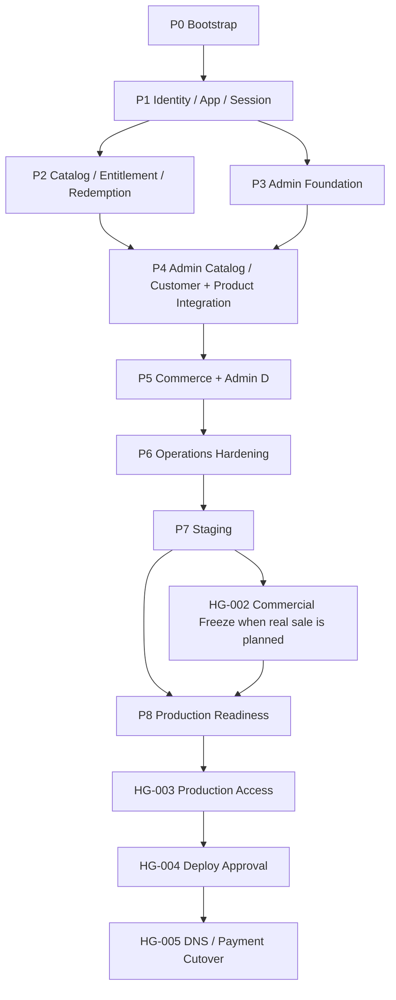

# AisenHub Platform Coding Agent Master Plan

## Overall Goal

Build the first AisenHub multi-product platform from the approved architecture with deterministic Local rebuilds, automated security/contract/E2E verification, an operable Refine Admin, Staging proof, and explicit Production gates—while minimizing human interaction and preventing architecture drift.

This plan creates no business implementation itself. It defines the executable task order and evidence required from future Coding Agents.

## Architecture Sources

1. [AisenHub Platform Backend Architecture](../AISENHUB_PLATFORM_BACKEND_ARCHITECTURE.md) — sole authority.
2. [Admin ADR](../admin架构.md) — Admin technical rationale; subordinate to the main architecture.
3. Repository root `AGENTS.md` and the Admin-scoped `app/AGENTS.md` — current engineering reality; the latter is to be preserved at `apps/admin/AGENTS.md` when scaffolded.
4. [Agent Execution Rules](./AGENT_EXECUTION_RULES.md) — mandatory operational behavior.
5. [Human Gates](./HUMAN_GATES.md) — exhaustive expected human interaction points.

An Agent must not silently amend architecture. Use `ARCHITECTURE_BLOCKER` only when implementation cannot safely continue under the approved design.

## Human Interaction Budget

| Scope | Budget |
| --- | ---: |
| Autonomous Bootstrap | 0 |
| Core Platform Local | 0 |
| Admin Local | 0 |
| Commerce Local | 0 |
| Staging Bootstrap | 0–1 consolidated gate |
| Production | Explicit approval gates |

## Phase Map

| Phase | File | Architecture stage | Primary result |
| --- | --- | --- | --- |
| P0 | [00-bootstrap.md](./phases/00-bootstrap.md) | Platform Phase 0 | Zero-human workspace, Supabase Local, test/CI baseline, `platform:verify` |
| P1 | [01-identity-application-session.md](./phases/01-identity-application-session.md) | Platform Phase 1 | Identity, app/origin, Host-only session, CORS/CSRF, account login |
| P2 | [02-catalog-entitlement-redemption.md](./phases/02-catalog-entitlement-redemption.md) | Platform Phase 2 | Catalog, Price, Grant, access resolution, Redemption, Audit |
| P3 | [03-admin-foundation.md](./phases/03-admin-foundation.md) | Admin Phase A | Refine + Ant Design shell, providers, RBAC, read-only operations |
| P4 | [04-admin-catalog-customer-integration.md](./phases/04-admin-catalog-customer-integration.md) | Admin B/C + product integration | Catalog/Redemption/Customer commands, account and AisenLens switch |
| P5 | [05-commerce.md](./phases/05-commerce.md) | Platform Commerce + Admin D | OrderItem fulfillment/refund/chargeback and Commerce operations |
| P6 | [06-operations-hardening.md](./phases/06-operations-hardening.md) | Admin E + operations | System health, actionable dashboard, retention, security/performance hardening |
| P7 | [07-staging.md](./phases/07-staging.md) | Staging | Remote deployment and automated smoke evidence |
| P8 | [08-production-readiness.md](./phases/08-production-readiness.md) | Production readiness | Release dossier and explicit production/cutover gates |

## Tracks

- Track A — Database: migrations, constraints, RLS, domain functions.
- Track B — API / Edge Functions: public/platform/admin/webhook APIs.
- Track C — Contracts / Clients: shared contracts, platform-client, admin-client.
- Track D — Account / Product UI: account and AisenLens integration.
- Track E — Admin UI: Refine application and Design System.
- Track F — Tests / Security: SQL, RLS, contract, integration, Playwright, secret scans.
- Track G — DevOps: workspace, local runtime, CI, Staging, release.

Tracks may run concurrently only when tasks say `Parallel Safe: yes`; contracts are shared and must be merged before consumers invent request/response types.

## Architecture Coverage Anchors

The phase tasks must preserve these exact approved anchors:

- Catalog: `products.current_version_id`, `product_prices`, immutable published `product_versions`.
- Entitlement: `source_type = order_item` for purchases; revoke keeps history; restore creates `source_type = admin_restore` and sets `restores_grant_id`.
- Admin Actions: `applications.change_production_origin`, `product_versions.publish`, `product_versions.retire`, `product_versions.set_current`, `redemption_batches.generate_codes`, `redemption_batches.pause`, `redemption_batches.close`, `entitlements.grant`, `entitlements.revoke`, `entitlements.restore`, `order_items.refund`, `admin_members.manage`, `audit_logs.read`.
- Admin API: `GET /v1/admin/session`, Resource Query, named Business Commands, and User/Order/Product overview queries.
- Portability: Supabase Managed PostgreSQL → Self-hosted PostgreSQL and Supabase Edge Functions → Node / Go backend, while clients continue to depend only on stable `/v1/*` contracts.

## Dependency Graph

Within phases, Database and Contracts may often proceed in parallel after the relevant contract/data invariants task. UI consumers start only after contract shapes are fixed and tested.

The complete task-level DAG and parallel lanes are maintained in [TASK_DEPENDENCY_GRAPH.md](./TASK_DEPENDENCY_GRAPH.md). A phase file's explicit `Dependencies` field wins if a diagram ever becomes stale.

## Phase Quality Gates

Every phase file ends with one gate task. The gate records actual PASS/FAIL/N/A for format, lint, typecheck, unit, database, RLS, API contract, integration, Edge Function, E2E, local reset, build, secret scan, and dependency-boundary checks. The gate must update `PROGRESS.md`, `TASK_LEDGER.md`, and create `checkpoints/PHASE-NN.md`.

No phase advances on a red applicable check. Repair within scope and rerun; do not ask the user to manually test.

## Progress and recovery

- [PROGRESS.md](./PROGRESS.md) is the current operational snapshot.
- [TASK_LEDGER.md](./TASK_LEDGER.md) is the immutable task history/index.
- `checkpoints/PHASE-NN.md` records phase evidence.
- `blockers/AB-NNN.md` records architecture blockers.
- [HUMAN_GATES.md](./HUMAN_GATES.md) records gate state and evidence.

The user reading progress does not pause execution. Only an explicit stop/hold instruction pauses autonomous work.

## Completion Definition

The first platform release is implementation-complete when:

- Local rebuild, migration, seed, and generated types are deterministic.
- Database, RLS, Edge/API, contract, client, Admin RBAC, redemption concurrency, idempotency, integration, E2E, build, secret, and dependency-boundary checks pass.
- Account, AisenLens, Admin, OrderItem refund, entitlement restore, Audit, and deletion flows match architecture.
- Admin has no direct database/Supabase Data Provider access and Refine is not a business authority.
- Documentation and progress ledger match actual commits/tests.
- Staging migration/deploy/smoke passes.
- No unresolved architecture deviation is hidden.

Production deployment is a separate explicit gate. The codebase may be implementation-complete and Staging-verified before production authorization/cutover.

## Start instruction for a new Agent

1. Read `AGENT_EXECUTION_RULES.md`.
2. Read repository root `AGENTS.md` and the nearest applicable scoped `AGENTS.md`.
3. Read `PROGRESS.md` and find the first ready task in `TASK_LEDGER.md`.
4. Read that task and only its cited architecture sections.
5. Mark it `in_progress`, execute autonomously, prove acceptance, commit, update progress, and continue.
