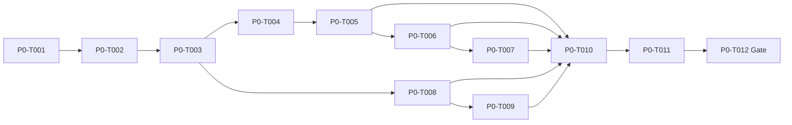
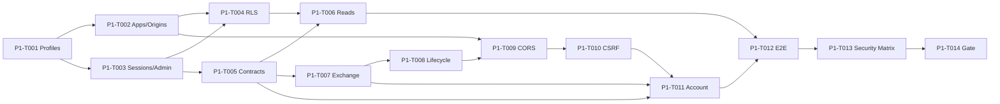
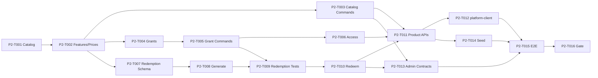
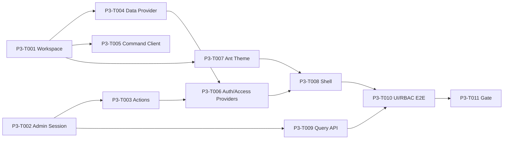
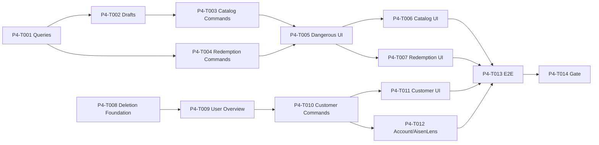
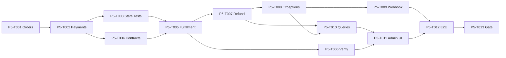
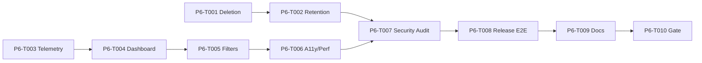
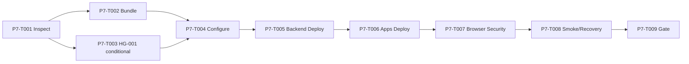
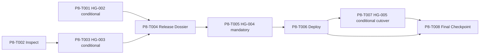

# AisenHub Platform Task Dependency Graph

> Task files remain authoritative for exact dependency text. An edge means the target cannot start until the source is completed. Tasks marked `Parallel Safe: yes` may run concurrently only when they do not edit the same shared contract, migration, lockfile, or progress files.

## P0 — Bootstrap

Parallel lane: P0-T004 database/runtime and P0-T008 contracts may proceed after P0-T003; merge before P0-T010.

## P1 — Identity / Application / Session

Parallel lanes: schema/contract preparation and account shell can proceed where dependencies allow; all converge at P1-T012.

## P2 — Catalog / Entitlement / Redemption

Parallel lanes: Catalog state, Entitlement state, and Redemption storage are separate until transaction/API integration.

## P3 — Admin Foundation

Parallel lanes: Backend Admin auth/query, client Providers, and Ant Design theme can proceed independently before shell/E2E integration.

## P4 — Admin B/C and Product Integration

Parallel lanes: Catalog/Redemption operations and Customer/deletion operations converge only at cross-system E2E.

## P5 — Commerce

## P6 — Operations Hardening

## P7 — Staging

P7-T003 is skipped automatically when authorization/resources already exist; it is the only Staging Human Gate.

## P8 — Production Readiness

Production deployment never starts before P8-T005 explicit approval. Cutover may remain deferred while P8-T008 reports a Staging-verified or deployed-but-not-live state.
